# 간단한 송금 시스템

## 프로젝트 설명
- 실제 금융 시스템의 흐름을 연습하고, 거래 데이터 처리, 메시징(Kafka), 그리고 AI 기반 카테고리 분류 같은 확장 기능까지 적용해본 개인 학습용 프로젝트입니다.
- **Spring Boot + React + FastAPI**를 사용해 백엔드, 프론트엔드, AI 서버를 분리하고,  
  Docker Compose로 전체 서비스를 묶어 통합적으로 실행할 수 있도록 설계했습니다.

## ✨ 주요 기능

- **로그인 / 인증**: JWT 기반 사용자 인증 및 보안 처리
- **계좌 관리**: 본인 계좌 조회, 잔액 확인
- **송금 처리**: 입력한 계좌로 송금, 금액 유효성 검증, 송금 처리 후 데이터 업데이트
- **거래 내역 조회**:
    - 입금 / 송금 / 전체 필터
    - 기간별 필터 (1개월, 3개월, 6개월, 전체)
    - 거래일, 계좌번호, 금액 포맷팅
    - 거래 내역 복사 기능, 금액 강조 표시
- **AI 카테고리 분류**:
    - 송금 메모 내용을 분석해 자동 카테고리 분류 (예: 식비, 교통, 쇼핑)
    - scikit-learn 기반 간단한 ML 모델 연동
- **비동기 메시징**:
    - Kafka로 송금 메시지 처리, 비동기 흐름 구현
- **컨테이너 기반 실행**:
    - Docker, Docker Compose로 전체 서비스 통합 실행


## 🛠 기술 스택

### Backend
- Spring Boot, PostgreSQL, Kafka, JWT, Docker

### Frontend
- React, Axios, Tailwind CSS, lucide-react

### AI Server
- FastAPI, scikit-learn, pandas, joblib, Python

---

## 🖼️ 서비스 화면 예시

<table>
  <tr>
    <td align="center">메인 화면</td>
    <td align="center">로그인 화면</td>
  </tr>
  <tr>
    <td></td>
    <td>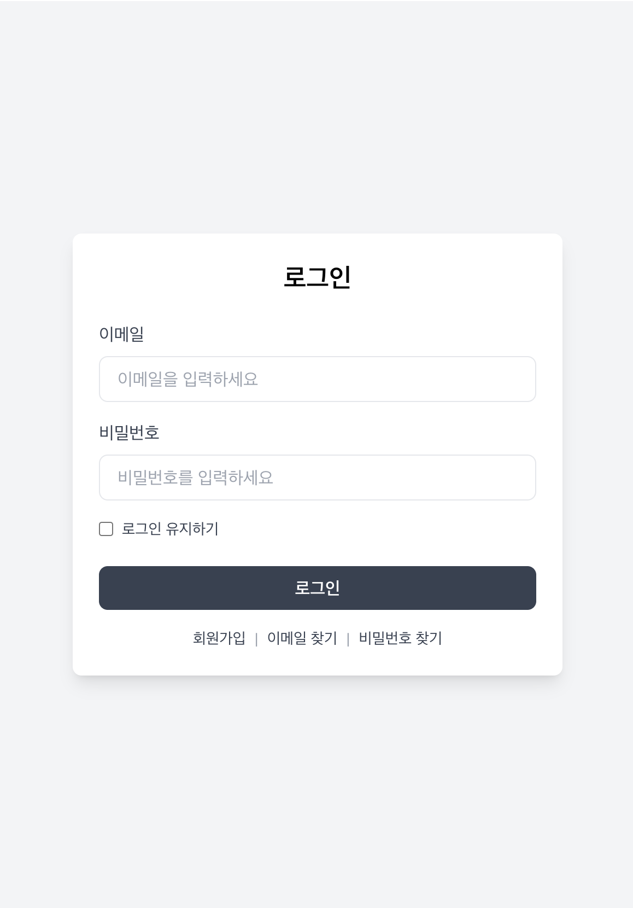</td>
  </tr>
  <tr>
    <td align="center">회원가입 화면</td>
    <td align="center">대시보드</td>
  </tr>
  <tr>
    <td>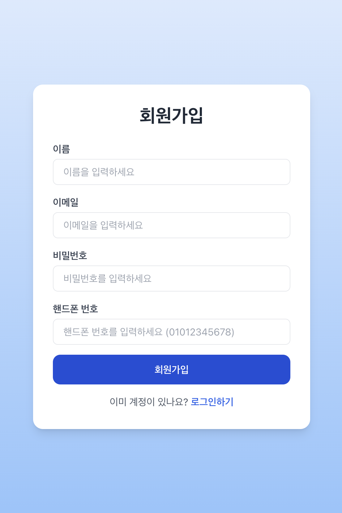</td>
    <td>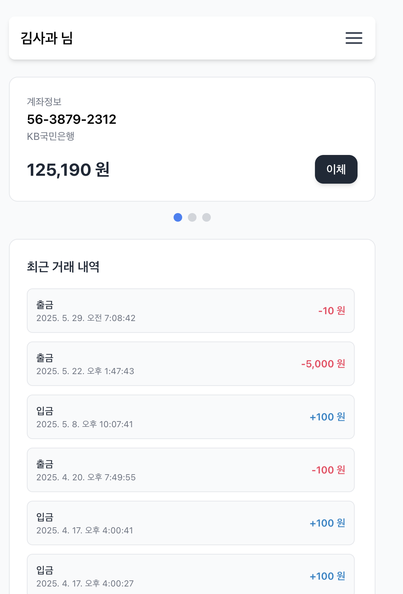</td>
  </tr>
  <tr>
    <td align="center">이메일찾기 화면</td>
    <td align="center">비밀번호찾기 화면</td>
  </tr>
  <tr>
    <td>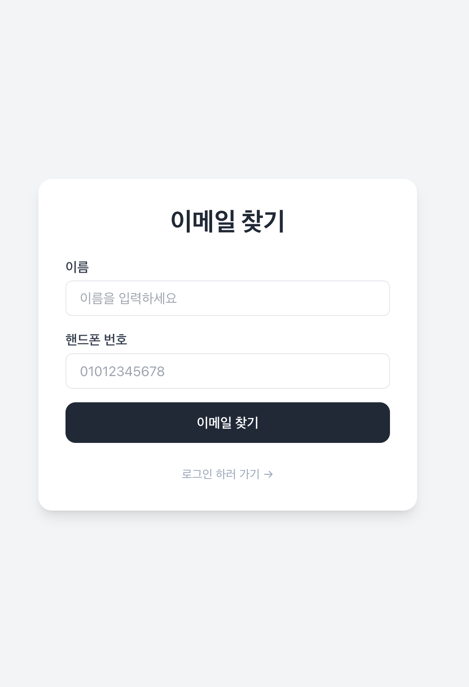</td>
    <td>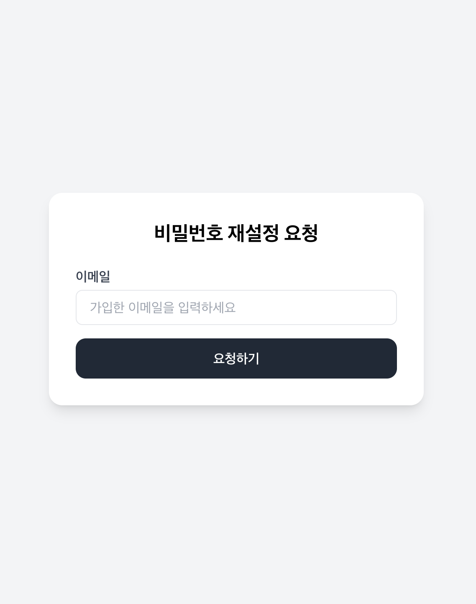</td>
  </tr>
  <tr>
    <td align="center">전체 계좌 조회</td>
    <td align="center">계좌 상세</td>
  </tr>
  <tr>
    <td>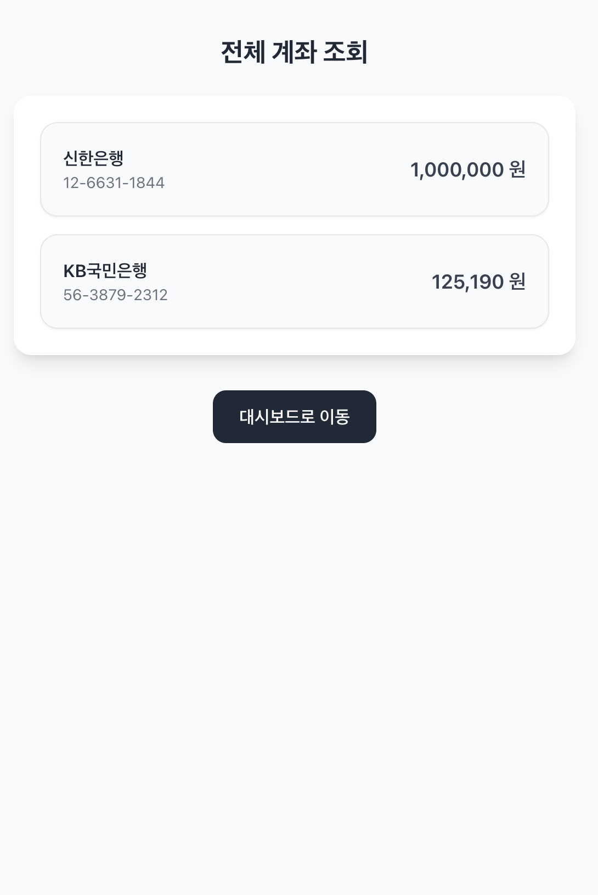</td>
    <td>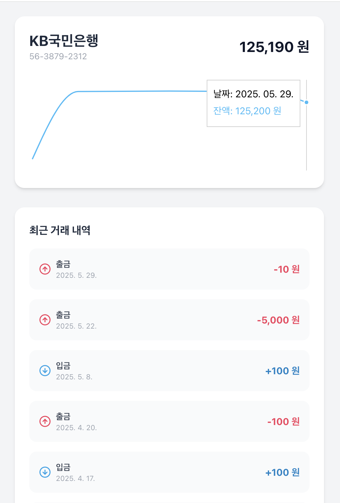</td>
  </tr>
  <tr>
    <td align="center">월별 소비 통계</td>
    <td align="center">거래 내역 조회</td>
  </tr>
  <tr>
    <td>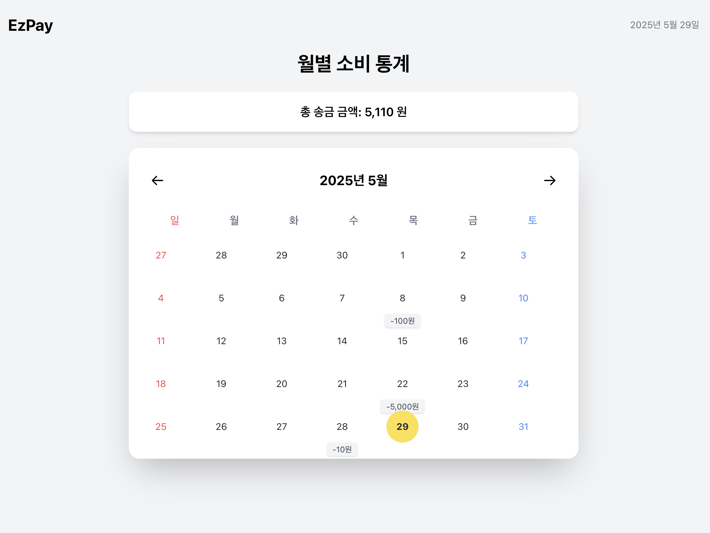</td>
    <td>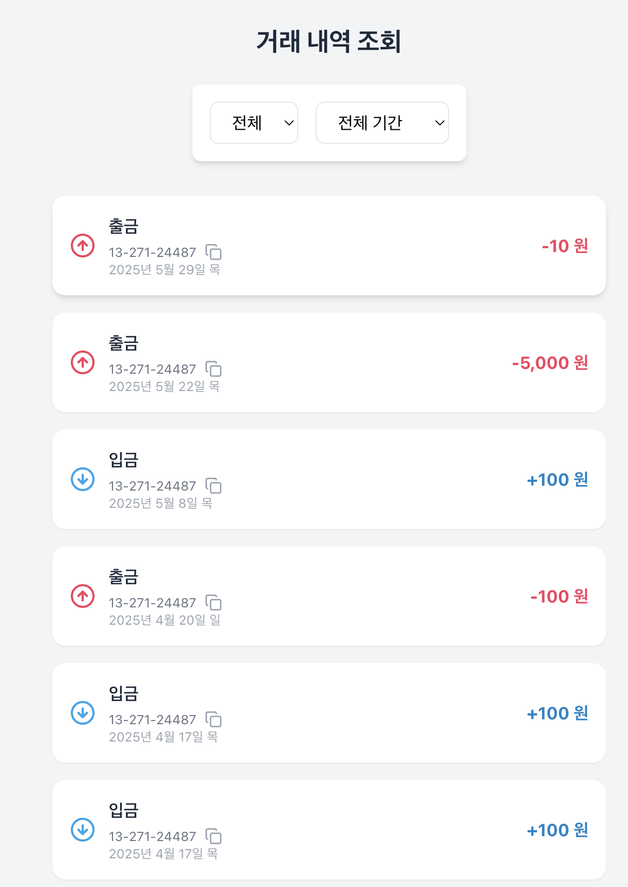</td>
  </tr>
  <tr>
    <td align="center">이체 화면</td>
    <td align="center">환경 설정</td>
  </tr>
  <tr>
    <td>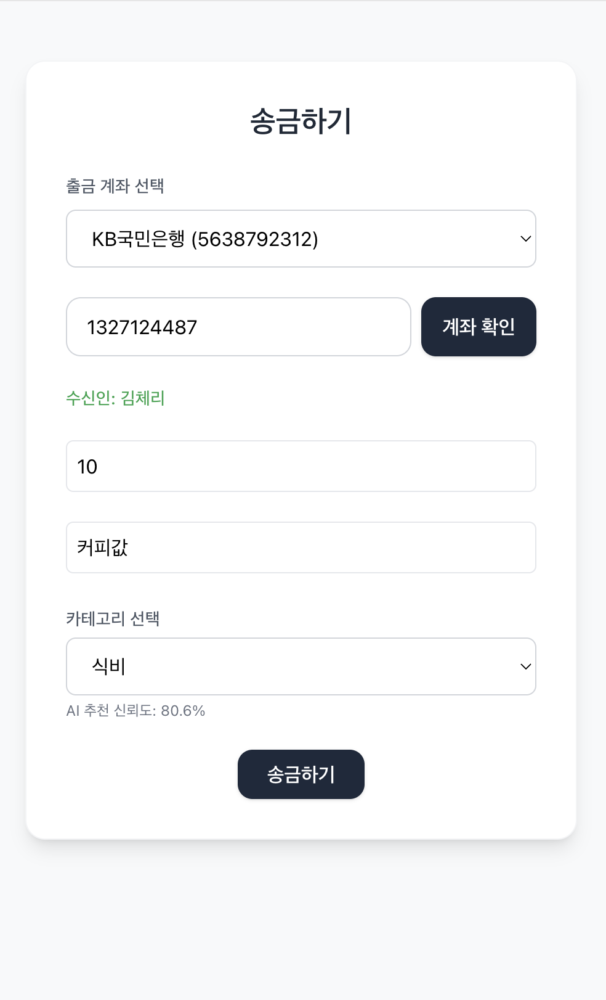</td>
    <td>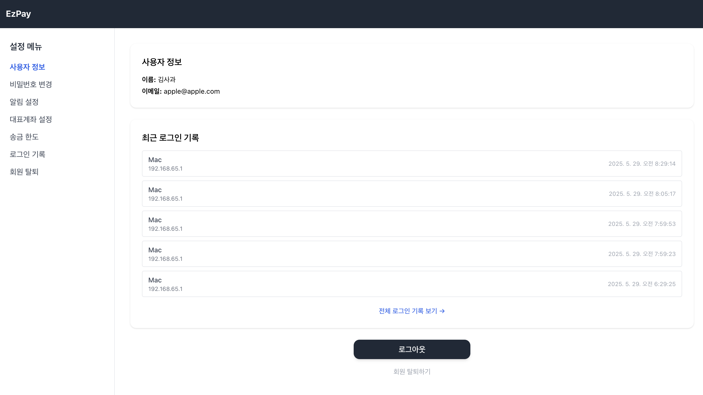</td>
  </tr>
  
</table>


---
## 🚀 프로젝트 실행 방법

### 🐳 전체 Docker 실행
```bash
docker-compose up --build
```
